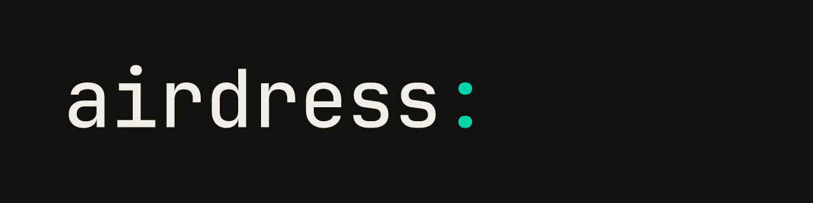

<p align="center">
  
</p>

# Airdress CLI

**Your airdress, from the terminal.** Sign in, see what it is doing,
deploy a function, open a shell on your own machine, connect your editor.

[Airdress](https://airdress.co) gives you a permanent, portable address for
your agents, devices and services, wherever they run. Your home server, NAS
and AI agents are reachable at one address you own, with TLS and
multi-device failover handled for you. The `airdress` CLI is how you work
with that address from a terminal, a script or an editor.

## What you can do

| You want to… | Run |
| --- | --- |
| Sign in and pick the airdress you work on | `airdress auth login`, `airdress airdress list`, `airdress a use <name>` |
| See where it is and how it is reached | `airdress airdress probe`, `airdress current` |
| Deploy a function from a directory to serving | `airdress fn deploy ./my-function` |
| Open a terminal on a machine of yours, end to end encrypted | `airdress shell` |
| Give an editor or an agent the same reach, over MCP | `airdress mcp serve` |
| Pair a phone, approve a machine, link a Home Assistant | `airdress device pair`, `airdress machines approve` |
| Install a plugin on your airdress | `airdress plugins install forms` |
| Declare resources and apply them | `airdress apply -f pool.yaml` |

Every command takes `--output json` and exits with a
[stable code](docs/exit-codes.md), so what you type today runs in a script
tomorrow.

## Install

Linux and macOS, with one line. It fetches the latest release, verifies its
checksum and installs it: a `.deb` through `apt` on Debian and Ubuntu,
otherwise a single binary in `~/.local/bin`.

```sh
curl -fsSL https://get.airdress.co/cli | sh
```

Windows and manual installs: download `airdress-<platform>` from the
[releases](https://github.com/airdress-co/airdress-cli/releases) and put it
on your `PATH`. Builds exist for Linux (x86_64, arm64), macOS (Intel, Apple
silicon) and Windows (x86_64).

Later, the CLI updates itself:

```sh
airdress update            # to the newest release
airdress update --check    # just ask
```

Shell completions: `airdress completion bash|zsh|fish|powershell|elvish`.

## Sixty seconds

```sh
airdress auth login                 # opens your browser, asks which account
airdress airdress list              # the airdresses you own
airdress a use home                 # pin one as current
airdress airdress probe             # how it is reached: direct or relayed

airdress fn new hello ./hello       # a function from a template
airdress fn keygen --out ~/.airdress/function-signing.key
airdress fn deploy ./hello --signing-key ~/.airdress/function-signing.key
airdress fn logs hello --follow     # watch it run
```

`deploy` checks the tree, shows you what it is about to do, asks once, and
waits until the function reports the new version loaded.

## Guides

- [Getting started](docs/getting-started.md): sign in, profiles, choosing
  the airdress a command acts on.
- [Functions](docs/functions.md): write, validate, deploy and promote
  code-first functions; the SDK; deploying from CI.
- [Shells](docs/shells.md): a terminal on your own machine, through your
  airdress.
- [Your airdress from an editor](docs/editor.md): the MCP server and the
  Claude Code plugin.
- [Devices, machines and homes](docs/devices-and-machines.md): phones,
  approved machines, Home Assistant, agent chat.
- [Plugins](docs/plugins.md): install, verify, authorize.
- [Resources](docs/resources.md): `apply`, `get`, `describe`, `delete`.
- [Scripting](docs/scripting.md): `--output json`, tokens, environment
  variables.
- [Exit codes](docs/exit-codes.md): the contract scripts rely on.
- [Keys and storage](docs/keys-and-storage.md): where profiles, tokens and
  device keys live.

## What leaves your machine

The CLI talks to your hub and to your airdresses. When you ask it to, it
also reaches the release server (`airdress update`) and the plugin registry
(`airdress plugins`). There is no analytics, no crash reporting and no
tracing exporter, and the build refuses the crates that would add one.
Credentials are never printed, logged or sent anywhere but where they
belong; `airdress auth token` prints one only because you asked for it.

## Support and security

- Questions and problems: [airdress.co/support](https://airdress.co/support)
  or <support@airdress.co>. Say which version you run (`airdress version`).
- Vulnerabilities: <security@airdress.co>. See [SECURITY.md](SECURITY.md).

## Contributing

[CONTRIBUTING.md](CONTRIBUTING.md) has the house rules and the checks a
change must pass.

## License

Apache-2.0. See [LICENSE](LICENSE), [NOTICE](NOTICE) and
[THIRD-PARTY.md](THIRD-PARTY.md).
